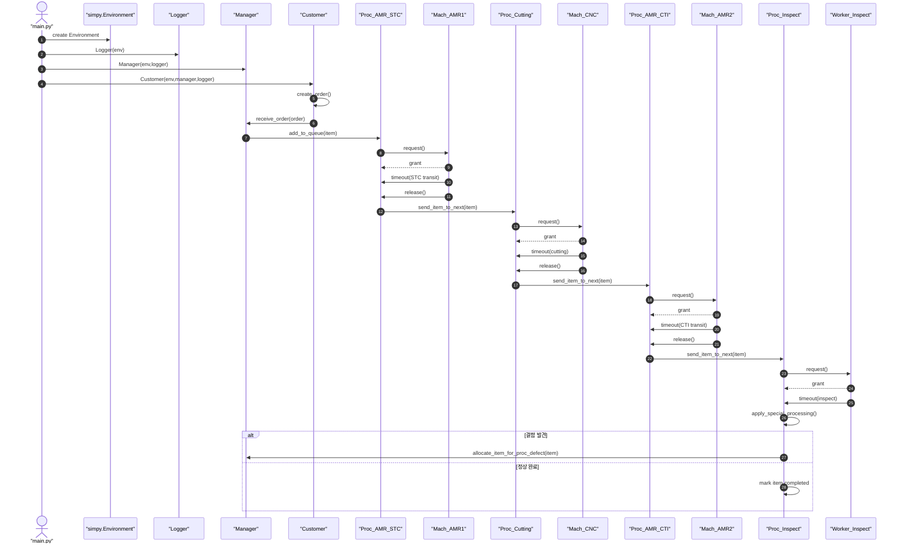

```mermaid
sequenceDiagram
    autonumber
    actor Main as "main.py"
    participant Env as "simpy.Environment"
    participant Logger as "Logger"
    participant Manager as "Manager"
    participant Customer as "Customer"

    participant STC_Proc as "Proc_AMR_STC"
    participant STC_AMR  as "Mach_AMR1"
    participant CNC_Proc as "Proc_Cutting"
    participant CNC_Mach as "Mach_CNC"
    participant CTI_Proc as "Proc_AMR_CTI"
    participant CTI_AMR  as "Mach_AMR2"
    participant Inspect_Proc as "Proc_Inspect"
    participant Inspector as "Worker_Inspect"

    %% 시뮬레이션 초기화
    Main->>Env: create Environment  
    Main->>Logger: Logger(env)  
    Main->>Manager: Manager(env,logger)  
    Main->>Customer: Customer(env,manager,logger)  

    %% 주문 생성 및 수신
    Customer->>Customer: create_order()  
    Customer->>Manager: receive_order(order)  

    %% 공급→CNC 운송
    Manager->>STC_Proc: add_to_queue(item)  
    STC_Proc->>STC_AMR: request()  
    STC_AMR-->>STC_Proc: grant  
    STC_AMR->>STC_Proc: timeout(STC transit)  
    STC_AMR->>STC_Proc: release()  
    STC_Proc->>CNC_Proc: send_item_to_next(item)  

    %% CNC 가공
    CNC_Proc->>CNC_Mach: request()  
    CNC_Mach-->>CNC_Proc: grant  
    CNC_Mach->>CNC_Proc: timeout(cutting)  
    CNC_Mach->>CNC_Proc: release()  
    CNC_Proc->>CTI_Proc: send_item_to_next(item)  

    %% CNC→검사 운송
    CTI_Proc->>CTI_AMR: request()  
    CTI_AMR-->>CTI_Proc: grant  
    CTI_AMR->>CTI_Proc: timeout(CTI transit)  
    CTI_AMR->>CTI_Proc: release()  
    CTI_Proc->>Inspect_Proc: send_item_to_next(item)  

    %% 검사
    Inspect_Proc->>Inspector: request()  
    Inspector-->>Inspect_Proc: grant  
    Inspector->>Inspect_Proc: timeout(inspect)  
    Inspect_Proc->>Inspect_Proc: apply_special_processing()  

    alt 결함 발견
        Inspect_Proc->>Manager: allocate_item_for_proc_defect(item)  
    else 정상 완료
        Inspect_Proc->>Inspect_Proc: mark item completed  
    end
```